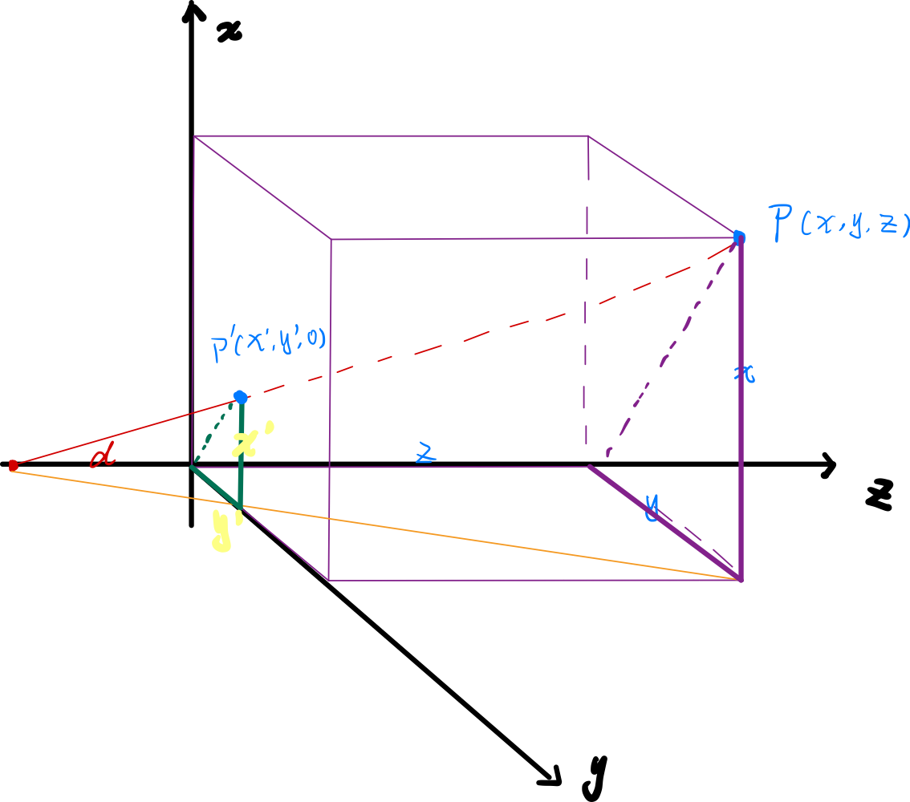
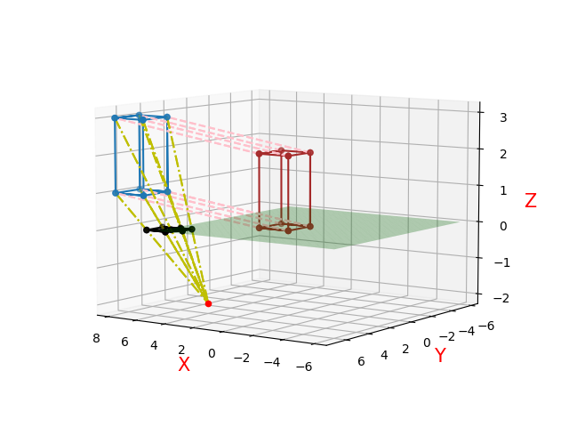
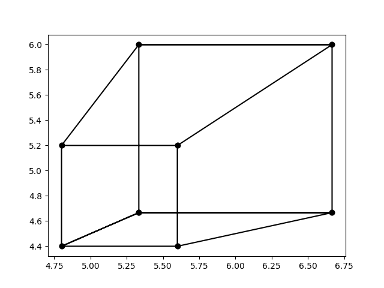
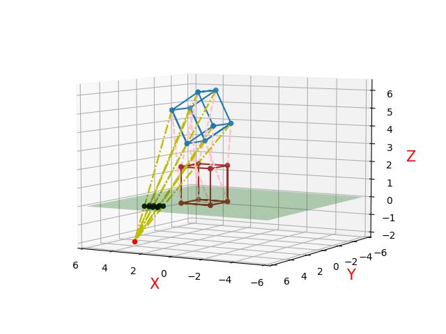
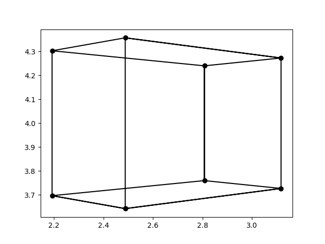
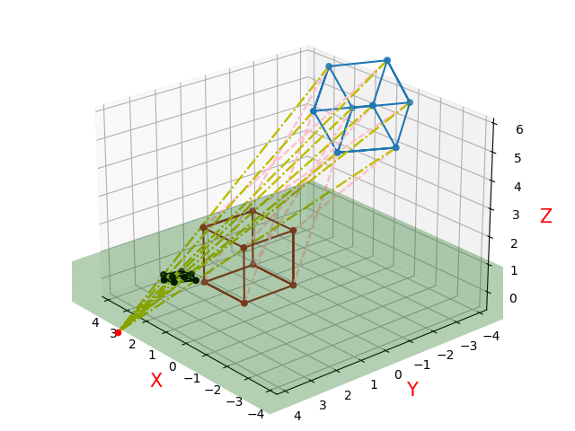
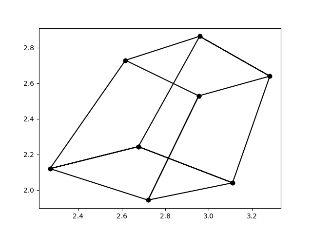

# 透视投影

# 总体思路：
&emsp;1.先透视变换&emsp;$P_{透视}$
&emsp;2.再投影&emsp;$P_{投影}$
&emsp;3.最终的变换矩阵&emsp;$T = P_{透视}P_{投影}$
&emsp;4.定点序列&emsp;$V_{new}=V_{origin}T $ 
# 1. 透视

## 1.1 一点透视

### 步骤：

&emsp;(1) 进行平移变换，将三维形体平移到适当位 置l、m、n；

&emsp;(2)进行透视变换；

&emsp;(3)进行投影变换，向xoy平面作正投影变换，将结果变换到xoy平面上。

&emsp;变换矩阵：

$P_{透视}=\begin{bmatrix} 1&0&0&0\\0&1&0&0\\0&0&1&0\\L&M&N&1\end{bmatrix}$

## 1.2 两点透视

### 步骤：

&emsp;(1)先将三维形体平移到适当位置，使视点有一定 高度，且使形体的主要表面不会积聚成线；

&emsp;(2)将形体绕y轴旋转一个φ⻆(φ<90 ̊)，方向满足 右手定则；

&emsp;(3)进行透视变换；

&emsp;(4)最后向xoy面作正投影，即得二点透视图。

&emsp;变换矩阵：

$P_{透视}=\begin{bmatrix} 1&0&0&0\\0&1&0&0\\0&0&1&0\\L&M&N&1\end{bmatrix}\begin{bmatrix} cos(φ)&0&sin(φ)&0\\0&1&0&0\\-sin(φ)&0&cos(φ)&0\\0&0&0&1\end{bmatrix}$

## 1.3 三点透视

### 步骤：

&emsp;(1)首先将三维形体平移到适当位置;；

&emsp;(2)将形体进行透视变换；

&emsp;(3)然后使形体先绕y轴旋转φ⻆；

&emsp;(4)再绕x轴旋转θ⻆；

&emsp;(5)将变形且旋转后的形体向xoy面作正投影。

&emsp;变换矩阵：

$P_{透视}=\begin{bmatrix} 1&0&0&0\\0&1&0&0\\0&0&1&0\\L&M&N&1\end{bmatrix}\begin{bmatrix} cosφ&0&sinφ&0\\0&1&0&0\\-sinφ&0&cosφ&0\\0&0&0&1\end{bmatrix}\begin{bmatrix} 1&0&0&0\\0&cosθ&sinθ&0\\0&-sinθ&cosθ&0\\0&0&0&1\end{bmatrix}$

# 2 投影

&emsp; 首先考虑这样一种最简单的情况，假设投影中心为坐标为  $(0, 0, -d)$ ，空间中任意一点$P(x,y,z)$,投影到$xOy$平面一点$P^’(x^’,y^’,0)$，由相似三角形易证:

$x^’= \frac{d}{d+z}*x$

$y^’= \frac{d}{d+z}*y$

&emsp; 易得，$P^’$的齐次坐标位为

 $[\frac{d}{d+z}*x,\frac{d}{d+z}*y,0,1]$ 

&emsp; 即

                                     

$[x,y,0,\frac{1+z}d]$

&emsp; 因此，投投影矩阵为

$P_{投影}=\begin{bmatrix} 1&0&0&0\\0&1&0&0\\0&0&0& \frac{1}{d} \\ 0&0&0&1 \\ \end{bmatrix}$

&emsp; 推广：空间任意一点作为投影中心，投影到xOy平面

 

$P_{投影}=\begin{bmatrix} 1&0&0&0\\0&1&0&0\\0&0&1&0 \\ -x_0&-y_0&0&1 \\ \end{bmatrix}\begin{bmatrix} 1&0&0&0\\0&1&0&0\\0&0&0& \frac{1}{d} \\ 0&0&0&1 \\ \end{bmatrix} \begin{bmatrix}  1&0&0&0\\0&1&0&0\\0&0&1&0 \\ x_0&y_0&0&1\\ \end{bmatrix}= \begin{bmatrix}  1&0&0&0\\0&1&0&0\\\frac{x}{d}& \frac{y}{d}&0& \frac{1}{d} \\ 0&0&0&1\\ \end{bmatrix}$

# 3 实例
&emsp;假设初始顶点序列表示一个顶点在原点，边长为2的正方体，视点在（4，4，-2），投影平面在$xOy$。
&emsp;用蓝色图形表示原图形；红色图形表示透视移动后的图形；黑色图形表示投影结果；绿色平面是投影平面；粉色虚线表示进行透视所进行的变换对应关系；黄色虚线表示投影进行的变换关系。
## 3.1 一点透视
&emsp;假设移动距离L=6，M=5，N=1

一点透视三维示意图

一点透视投影结果

## 3.2 二点透视
&emsp;假设移动距离L=6，M=5，N=1，φ=40$^。$

一二点透视三维示意图

二点透视投影结果

## 3.3 三点透视
&emsp;假设移动距离L=1，M=-3，N=4，φ=45$^。$,θ=30$^。$

三点透视三维示意图

三点透视投影结果

